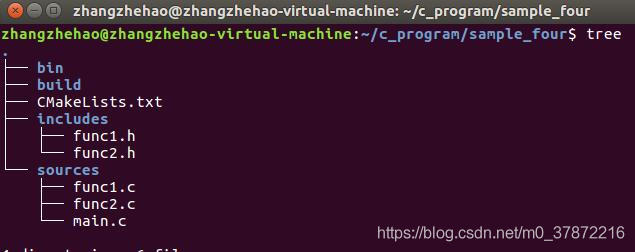

## cmake 学习笔记


#### 1. 例子 



```cmake
make_minimum_required(VERSION 2.8)#cmake最低版本为2.8

project(demo)#项目名称

aux_source_directory(sources SRC_LIST)#将源文件夹中的源文件集合定义为变量

include_directories(includes)#添加头文件路径

add_executable(main ${SRC_LIST})#生成elf文件名为main，源文件在源文件夹中

set(EXECUTABLE_OUTPUT_PATH ${PROJECT_SOURCE_DIR}/bin)#将工程根目录下的bin文件夹作为输出
#`EXECUTABLE_OUTPUT_PATH`、变量`PROJECT_SOURCE_DIR`都是cmake中的预设量，分别意为“可执行文件保存的路径”，“工程的根目录”。
```
